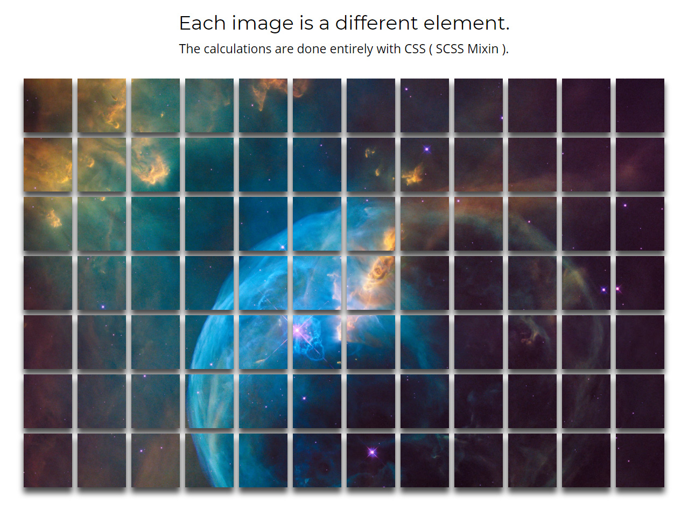

# SCSS mixin for the sake of exploration
## This shows the power of scss mixins, check it out 🚀

## View locally
###`npm install` 
###`npm run start`  

- open ./src/index.html in a live server ( use live server plugin for VSCode or similar )  
- edit ./sass/main.scss  
  - Gulp will compile and compress the files
  - View live updates in live server on save of main.scss

## Example project
The example shows visually how the mixin calculates the correct image location for each list item, In the end we have CSS handling our grid system without any JS. Additionally, these list items could be generated automatically with JS. Some really cool things could be done here if explored further.  

**View live codepen version @** 🔗 https://codepen.io/litonfiredesign/pen/zMpgMZ

## Boilerplates
**Full Stack React Dev:**
https://github.com/slaterbbx/Fullstackinator 
**Stand WebDev-Sandbox with Webpack & Babel:**
https://github.com/slaterbbx/WebDev-SandBox

## License
MIT License | IMG-Gridify © 2019 Kyle Gallagher